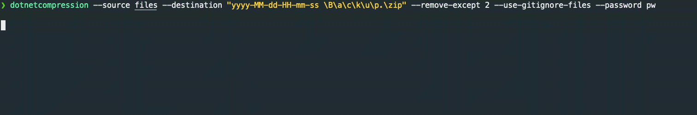

# DotNetCompression


Cross-platform CLI tool to compress folders using C# and .NET Core.

Although it is designed with my daily use-cases in mind, it hosts a variety of beneficial features such as `.gitignore` parsing, automatic archive deletion, archive integrity checks, automatic date insertion, and creation of password-protected archives.

To get started, install [.NET 7.0](https://dotnet.microsoft.com/en-us/download/dotnet/7.0). A basic command to use this tool would be:

```sh
dotnet run -- --source files --destination "yyyy-MM-dd-HH-mm-ss \B\a\c\k\u\p.\zip" --remove-except 2 --use-gitignore-files --password pw
```

It reveals its true potential when integrated with aliases and automated workflows.

## Features
Run `dotnet run -- --help` to explore all supported capabilities.

```
Copyright (C) 2023 Marius Freitag

  -s, --source                 Required. Source directory.

  -d, --destination            Required. Destination file as DateTime format (see https://docs.microsoft.com/en-us/dotnet/standard/base-types/custom-date-and-time-format-strings).

  -r, --remove-except          Only keep the latest archives up to the given count.

  -i, --ignore-file            File to get information on which files to ignore. This must be in the .gitignore format.

  -g, --use-gitignore-files    Specifies that all .gitignore files should be added as ignore files.

  -p, --password               Password to encrypt the resulting archive with.

  --help                       Display this help screen.

  --version                    Display version information.
```

## Development
- Execute the program using `dotnet run`
- Format the source code with `dotnet format DotNetCompression.sln`
- Build and lint the project using `dotnet build /WarnAsError`